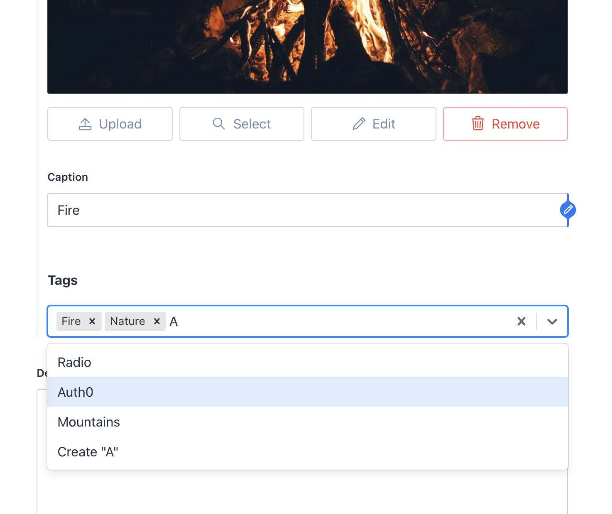

# Sanity Autocomplete Tags Dropdown Plugin 🚀

This plugin creates a custom tags input field for Sanity Studio. This custom input field allows users to type tags, select existing ones from the dropdown or create new ones. This is handy if you want to offer authors an experience of "type, hit Enter, repeat" for adding tags.



## How To Use

This plugin is easy to use and set up.

### Installation

```sh
sanity install sanity-studio-autocomplete-tags
```

That'll do it. Easy, eh? ;)

### Configuration

Since this plugin requires writing permissions to Sanity, we need to configure it.

You'd need two self-explanatory environment variables to make it work: `SANITY_PROJECT_ID` and `SANITY_TOKEN`. Please note that the token should be of "Read and Write" kind. More on this [here](https://www.sanity.io/docs/http-auth#robot-tokens-504058b73b71)

### Implementation

Whenever you want to add tags to an item in your schema, just add this snippet

```js
{
  name: 'tags',
  title: 'Tags',
  type: 'array',
  description: 'Add tags that describe this photo.',
  inputComponent: sanityTagAutocomplete,
  of:[{type: "tag"}],
  options: {
    layout: "tags",
    isHighlighted: true,
  }
}
```

Yep, that's it.
